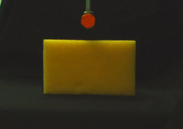
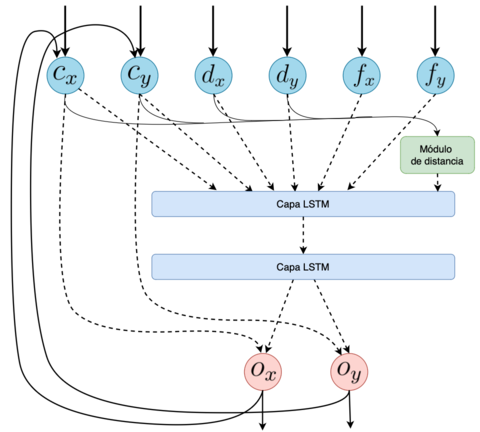
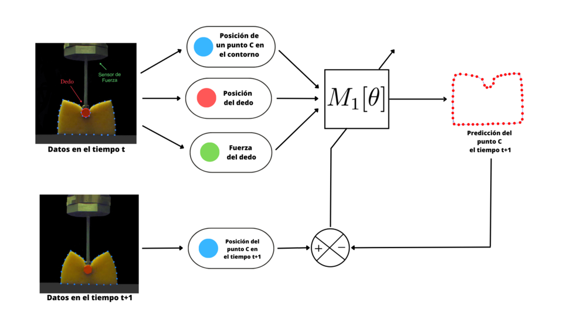
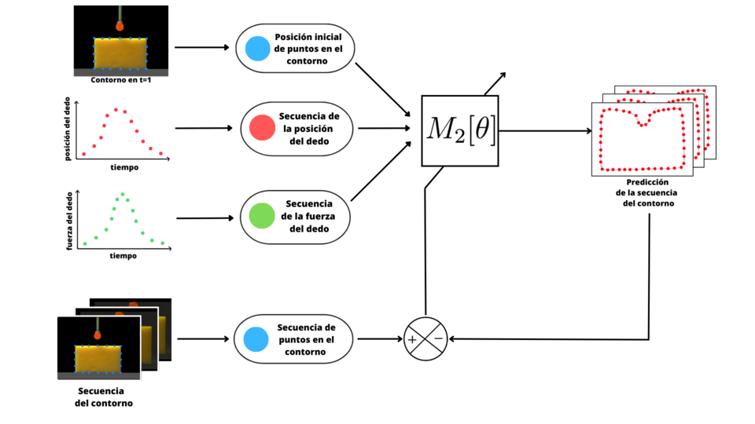

# Deformation-Tracker
This repo contains the research journal for a model that predicts the deformation of objects.

The results of the research were successful, with only four videos of the deformation of an object,
the model is able to make close predictions to the real deformation.

# Summary:
A robotic finger interacts with deformable objects, such as a dish-washing sponge, by pressing the object and recording the deformation process with a camera
and a force sensor located on the robotic finger.
Generating this kind of videos



## The Problem:
We want to create a model that predicts the deformation of the object.
The input of this model is the initial state of the object and the trajectory that the robotic finger will follow.
With this input data the model will predict the deformation sequence of the object.

# Best model arquitecture
This is the architecture of the model with the best results. Internally it uses a LSTM network.



All the files related to the best model can be found on the `src/final_experiment` directory.
# Training
The model uses a training technique called `teacher forcing`. This technique is very useful to train recurrent models.
This technique splits the training process into two phases.

### Phase 1: Training with teacher forcing
On this phase we teach the model to predict one step of the deformation at a time.
By doing this we don't overwhelm the model with the whole deformation sequence and it's easier for the model to learn.


### Phase 2: Training without teacher forcing
This time we train the model using the whole deformation sequence using the weights of the model trained on the previous phase to initialize the model. This way we ensure the model resumes the training.



# Predictions
In the end, with only four videos and 10 minutes of training, the model is able to make these kind of predictions:


The result would be better with more data, but it was difficult to access the force sensor.

# Commands
The final model was a result of many trial and error experiments that can be found on the `src` directory.


To execute these experiments run:
Run script with the default options
```
python src/basic_recurrent.py
```

See all the possible options you can execute the script with
```
python src/basic_recurrent.py --help
```

## Visualize training loss with Tensorboard
Tensorboard is used to visualize the training loss.

Run this command to run tensorboard:
```
tensorboard --logdir=./logs --port=6006
```


<!---
To fix the code format according to the PEP8 standard:
```
black .
```

My resources:

To create a tf Dataset:
https://medium.com/when-i-work-data/converting-a-pandas-dataframe-into-a-tensorflow-dataset-752f3783c168

mypy type cheat sheet:
https://mypy.readthedocs.io/en/stable/cheat_sheet_py3.html

simple encoder-decoder, sequence to sequence:
https://wandb.ai/ayush-thakur/dl-question-bank/reports/LSTM-RNN-in-Keras-Examples-of-One-to-Many-Many-to-One-Many-to-Many---VmlldzoyMDIzOTM#what-are-many-to-many-sequence-problems?

Return sequences and return states:
https://machinelearningmastery.com/return-sequences-and-return-states-for-lstms-in-keras/

To investigate:

Furier Descriptors: https://arxiv.org/abs/1806.03857
paper: https://arxiv.org/pdf/1806.03857.pdf

GNGN guideline:
 - http://neupy.com/apidocs/neupy.algorithms.competitive.growing_neural_gas.html
 - https://github.com/itdxer/neupy/blob/master/notebooks/growing-neural-gas/Growing%20Neural%20Gas%20animated.ipynb
 - https://github.com/itdxer/neupy/blob/master/neupy/algorithms/competitive/growing_neural_gas.py
 - https://github.com/ansrivas/GNG


 # To generate gif
 brew install ImageMagick
 convert $(ls *.jpg | sort -V) out.gif

-->